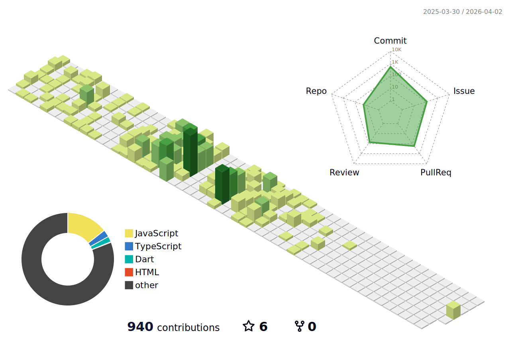
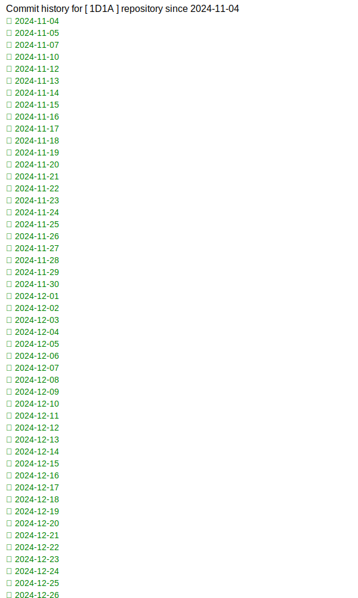

# 1D1A
This is an auto push repository for Baekjoon Online Judge created with [BaekjoonHub](https://github.com/BaekjoonHub/BaekjoonHub).

### 🐍 GitHub Contribution

### 📊 Python Generated Contribution SVG

<!---LeetCode Topics Start-->
# LeetCode Topics
## Array
|  |
| ------- |
| [0001-two-sum](https://github.com/eunsoA/1D1A/tree/master/0001-two-sum) |
| [0121-best-time-to-buy-and-sell-stock](https://github.com/eunsoA/1D1A/tree/master/0121-best-time-to-buy-and-sell-stock) |
| [0733-flood-fill](https://github.com/eunsoA/1D1A/tree/master/0733-flood-fill) |
| [0792-binary-search](https://github.com/eunsoA/1D1A/tree/master/0792-binary-search) |
## Hash Table
|  |
| ------- |
| [0001-two-sum](https://github.com/eunsoA/1D1A/tree/master/0001-two-sum) |
| [0141-linked-list-cycle](https://github.com/eunsoA/1D1A/tree/master/0141-linked-list-cycle) |
| [0242-valid-anagram](https://github.com/eunsoA/1D1A/tree/master/0242-valid-anagram) |
## String
|  |
| ------- |
| [0020-valid-parentheses](https://github.com/eunsoA/1D1A/tree/master/0020-valid-parentheses) |
| [0125-valid-palindrome](https://github.com/eunsoA/1D1A/tree/master/0125-valid-palindrome) |
| [0242-valid-anagram](https://github.com/eunsoA/1D1A/tree/master/0242-valid-anagram) |
## Stack
|  |
| ------- |
| [0020-valid-parentheses](https://github.com/eunsoA/1D1A/tree/master/0020-valid-parentheses) |
## Linked List
|  |
| ------- |
| [0021-merge-two-sorted-lists](https://github.com/eunsoA/1D1A/tree/master/0021-merge-two-sorted-lists) |
| [0141-linked-list-cycle](https://github.com/eunsoA/1D1A/tree/master/0141-linked-list-cycle) |
## Recursion
|  |
| ------- |
| [0021-merge-two-sorted-lists](https://github.com/eunsoA/1D1A/tree/master/0021-merge-two-sorted-lists) |
## Dynamic Programming
|  |
| ------- |
| [0121-best-time-to-buy-and-sell-stock](https://github.com/eunsoA/1D1A/tree/master/0121-best-time-to-buy-and-sell-stock) |
## Two Pointers
|  |
| ------- |
| [0125-valid-palindrome](https://github.com/eunsoA/1D1A/tree/master/0125-valid-palindrome) |
| [0141-linked-list-cycle](https://github.com/eunsoA/1D1A/tree/master/0141-linked-list-cycle) |
## Tree
|  |
| ------- |
| [0110-balanced-binary-tree](https://github.com/eunsoA/1D1A/tree/master/0110-balanced-binary-tree) |
| [0226-invert-binary-tree](https://github.com/eunsoA/1D1A/tree/master/0226-invert-binary-tree) |
| [0235-lowest-common-ancestor-of-a-binary-search-tree](https://github.com/eunsoA/1D1A/tree/master/0235-lowest-common-ancestor-of-a-binary-search-tree) |
## Depth-First Search
|  |
| ------- |
| [0110-balanced-binary-tree](https://github.com/eunsoA/1D1A/tree/master/0110-balanced-binary-tree) |
| [0226-invert-binary-tree](https://github.com/eunsoA/1D1A/tree/master/0226-invert-binary-tree) |
| [0235-lowest-common-ancestor-of-a-binary-search-tree](https://github.com/eunsoA/1D1A/tree/master/0235-lowest-common-ancestor-of-a-binary-search-tree) |
| [0733-flood-fill](https://github.com/eunsoA/1D1A/tree/master/0733-flood-fill) |
## Breadth-First Search
|  |
| ------- |
| [0226-invert-binary-tree](https://github.com/eunsoA/1D1A/tree/master/0226-invert-binary-tree) |
| [0733-flood-fill](https://github.com/eunsoA/1D1A/tree/master/0733-flood-fill) |
## Binary Tree
|  |
| ------- |
| [0110-balanced-binary-tree](https://github.com/eunsoA/1D1A/tree/master/0110-balanced-binary-tree) |
| [0226-invert-binary-tree](https://github.com/eunsoA/1D1A/tree/master/0226-invert-binary-tree) |
| [0235-lowest-common-ancestor-of-a-binary-search-tree](https://github.com/eunsoA/1D1A/tree/master/0235-lowest-common-ancestor-of-a-binary-search-tree) |
## Sorting
|  |
| ------- |
| [0242-valid-anagram](https://github.com/eunsoA/1D1A/tree/master/0242-valid-anagram) |
## Binary Search
|  |
| ------- |
| [0792-binary-search](https://github.com/eunsoA/1D1A/tree/master/0792-binary-search) |
## Matrix
|  |
| ------- |
| [0733-flood-fill](https://github.com/eunsoA/1D1A/tree/master/0733-flood-fill) |
## Binary Search Tree
|  |
| ------- |
| [0235-lowest-common-ancestor-of-a-binary-search-tree](https://github.com/eunsoA/1D1A/tree/master/0235-lowest-common-ancestor-of-a-binary-search-tree) |
<!---LeetCode Topics End-->