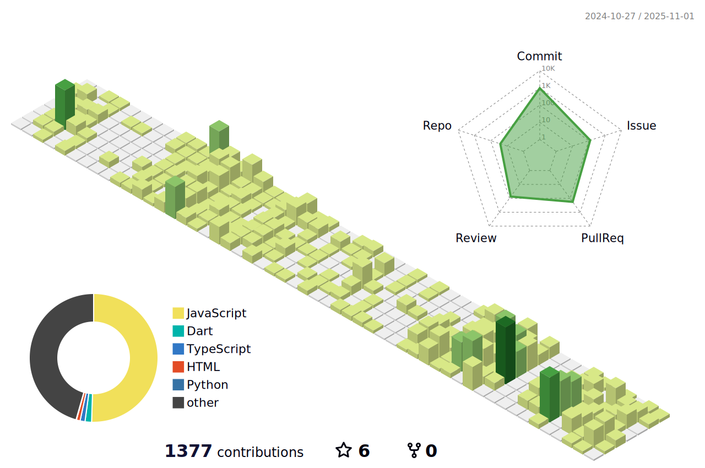

# 1D1A
This is an auto push repository for Baekjoon Online Judge created with [BaekjoonHub](https://github.com/BaekjoonHub/BaekjoonHub).

### 🐍 GitHub Contribution

### 📊 Python Generated Contribution SVG

<!---LeetCode Topics Start-->
# LeetCode Topics
## Array
|  |
| ------- |
| [0001-two-sum](https://github.com/eunsoA/1D1A/tree/master/0001-two-sum) |
## Hash Table
|  |
| ------- |
| [0001-two-sum](https://github.com/eunsoA/1D1A/tree/master/0001-two-sum) |
## String
|  |
| ------- |
| [0020-valid-parentheses](https://github.com/eunsoA/1D1A/tree/master/0020-valid-parentheses) |
## Stack
|  |
| ------- |
| [0020-valid-parentheses](https://github.com/eunsoA/1D1A/tree/master/0020-valid-parentheses) |
<!---LeetCode Topics End-->